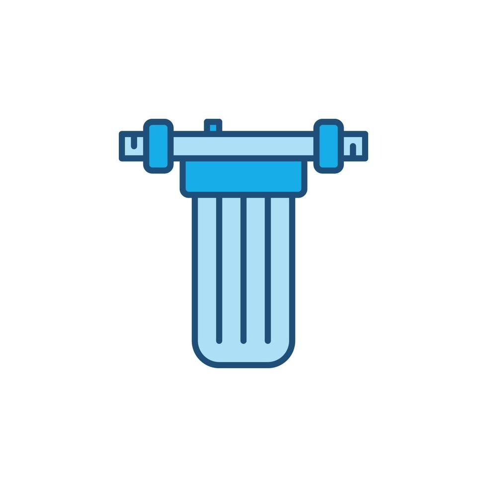

# Smart Aqua Technologies — Product Showcase Website

A modern, responsive website for **Smart Aqua Technologies**, showcasing industrial-grade filtration solutions across water, air, and process systems.



## 🌐 Live Sections

| Section | Description |
|---------|-------------|
| **Hero** | Animated gradient background with floating bubbles, company stats, and CTA buttons |
| **Products** | 9 product categories with tabbed navigation, category banner images, and detailed product cards |
| **About** | Company strengths, feature grid, and MD leadership profile |
| **Contact** | Contact form with company details |
| **Footer** | Quick links, product categories, and support info |

## 📦 Product Categories

- Filter Cartridges (10 products)
- Filter Housings (4 products)
- RO Membranes (4 products)
- Speciality Filters (3 products)
- Air Filtration (7 products)
- Dust Collection (5 products)
- Oil Filtration (5 products)
- Liquid Systems (6 products)
- Paint Arrest Filters (4 products)

## 🛠️ Tech Stack

- **React** — Component-based UI
- **Vite** — Fast dev server and build tool
- **Vanilla CSS** — Custom design system with CSS variables
- **No external UI libraries** — Fully custom components

## 🎨 Design System

- **Theme**: Dark navy/blue with cyan accents
- **Effects**: Glass-morphism cards, animated gradients, floating bubbles
- **Typography**: Inter font family via Google Fonts
- **Responsive**: Mobile-first breakpoints at 768px and 900px

## 🚀 Getting Started

```bash
# Install dependencies
npm install

# Start dev server
npm run dev

# Build for production
npm run build

# Preview production build
npm run preview
```

## 📁 Project Structure

```
├── public/
│   └── images/          # Product photos, category images, logos
├── src/
│   ├── components/
│   │   ├── Navbar.jsx   # Sticky nav with scroll effect & mobile menu
│   │   ├── Hero.jsx     # Animated hero with stats bar
│   │   ├── Products.jsx # Tabbed product catalogue (9 categories)
│   │   ├── About.jsx    # Company info + MD leadership profile
│   │   ├── Contact.jsx  # Contact form
│   │   ├── Footer.jsx   # Site footer
│   │   └── *.css        # Component-specific styles
│   ├── App.jsx          # Root component
│   ├── index.css        # Global styles & design tokens
│   └── main.jsx         # Entry point
└── index.html
```

## 👤 Leadership

**Mr. Rajkumar Muthusamy** — Managing Partner
- 30 years of experience in Marketing, Business Development & Administration
- Expertise across WTP/RO plants, air filtration, dust collection, oil filtration, and more

## 📞 Contact

- **Telephone**: 044-4280 8146
- **Mobile**: 9382382318 / 9382382312

---

© 2026 Smart Aqua Technologies. All rights reserved.
